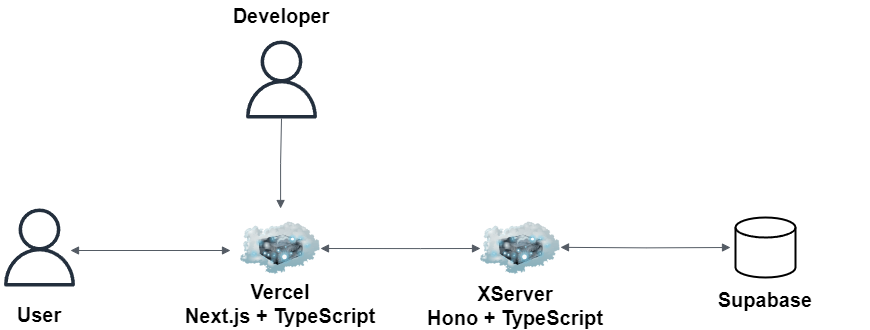

# Next.js + Hono + TypeScript + SupabaseによるメッセンジャーWebアプリケーション

## Summary

メッセンジャーWebアプリケーションのフロント側。

## Tech

- frontend
  - Next.js
  - TypeScript
- backend
  - Hono
  - TypeScript
- DB and Authentication
  - Supabase
- Web Hosting Service
  - Vercel

## Architecture

## Backend

以下リポジトリで構築する。

https://github.com/kojikawazu/nextjs-hono-back-messanger-app

## URL

- [Bun](https://bun.sh/guides/ecosystem/nextjs)

- [Hono](https://hono.dev/getting-started/basic)

- [Supabase](https://supabase.com)

- [Prisma](https://www.prisma.io)

- [Vercel](https://vercel.com/kojikawazus-projects)

- [TailwindComponent](https://tailwindcomponents.com/)